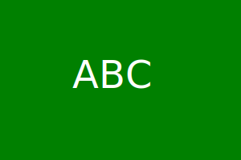

# 10 Object-oriented Programming: SVG Logo Maker

## Task

Task is to build a Node.js command-line application that takes in user input to generate a logo and save it as an SVG file. The application prompts the user to select a color and shape, provide text for the logo, and save the generated SVG to a `.svg` file.


### User Story

```md
AS a freelance web developer
I WANT to generate a simple logo for my projects
SO THAT I don't have to pay a graphic designer
```

## Acceptance Criteria

```md
GIVEN a command-line application that accepts user input
WHEN I am prompted for text
THEN I can enter up to three characters
WHEN I am prompted for the text color
THEN I can enter a color keyword (OR a hexadecimal number)
WHEN I am prompted for a shape
THEN I am presented with a list of shapes to choose from: circle, triangle, and square
WHEN I am prompted for the shape's color
THEN I can enter a color keyword (OR a hexadecimal number)
WHEN I have entered input for all the prompts
THEN an SVG file is created named `logo.svg`
AND the output text "Generated logo.svg" is printed in the command line
WHEN I open the `logo.svg` file in a browser
THEN I am shown a 300x200 pixel image that matches the criteria I entered
```

## Acheivements

A Inquirer command-line application prompts that accepts user input for text
THEN I enter up to three characters
THEN I am prompted for the text color
THEN I enter a color keyword (OR a hexadecimal number)
THEN I am prompted for a shape
THEN I SELECT FROM list of shapes to choose from: circle, triangle, and square
WHEN I am prompted for the shape's color
THEN I enter a color keyword (OR a hexadecimal number)
WHEN I have entered input for all the prompts
THEN an SVG file is created named `logo.svg`
AND the output text "Generated logo.svg" is printed in the command line
WHEN I open the `logo.svg` file in a browser
THEN I show a 300x200 pixel image that matches the criteria I entered




## Installtion

1.) npm init


2.) npm install


3.) npm install inquirer@8.2.4


4.) npm install jest@24.9.0 --save --dev


5.) npm install -g mocha


mocha is install if jest creates any error in installtion due to bugs in jest.

## Test

1.) mocha circle.test.js

2.) mocha triangle.test.js

3.) mocha square.test.js

4.) node index.js


A video of test can be seen below

https://drive.google.com/file/d/1wb0rR-YDSGeYAIGe_WzXajtdbYv1_2jg/view


